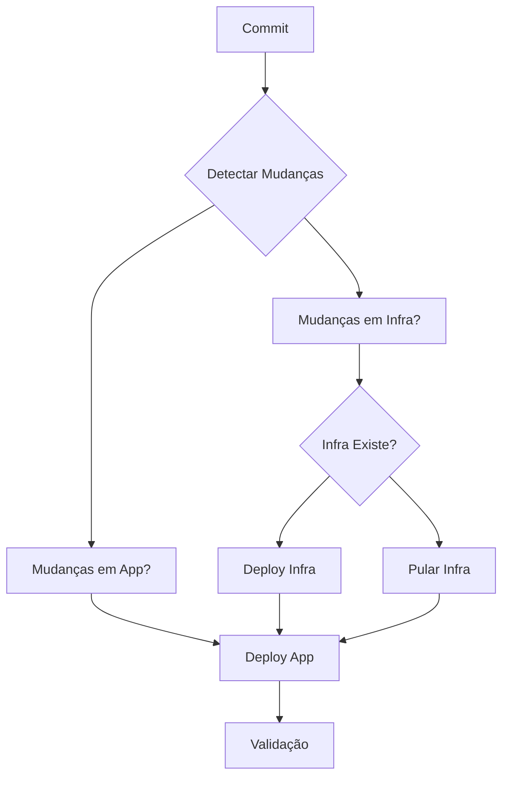

# 🚀 Arquitetura de CI/CD Multinuvem - Formerr

## 📋 Visão Geral

Esta arquitetura implementa um sistema de CI/CD completo e automatizado para o projeto Formerr, seguindo as melhores práticas de DevOps e GitOps. O sistema é composto por **6 pipelines distintas** que trabalham em conjunto para garantir deploy seguro, rastreável e automatizado em dois ambientes separados na DigitalOcean.

## 🏗️ Arquitetura de Ambientes

### 🌍 Ambientes Implementados

1. **Produção (Production)**
   - Cluster Kubernetes na DigitalOcean (conta #1)
   - Região: New York
   - Banco de dados gerenciado
   - Monitoramento completo (Prometheus + Grafana)
   - Deploy automático via branch `main`

2. **Homologação (Staging)**
   - Cluster Kubernetes na DigitalOcean (conta #2)
   - Região: Frankfurt
   - Banco de dados isolado
   - Monitoramento básico
   - Deploy automático via branch `develop`

## 🔄 Pipelines Implementadas

### 1. 🎯 Pipeline Orquestradora (`orchestrator.yml`)

**Responsabilidade:** Identifica o contexto do commit e decide quais pipelines executar.

**Funcionalidades:**
- ✅ Detecção automática de mudanças (infraestrutura vs aplicação)
- ✅ Verificação de infraestrutura existente via API DigitalOcean
- ✅ Decisão inteligente sobre qual pipeline executar
- ✅ Idempotência e eficiência operacional
- ✅ Suporte a deploy manual com parâmetros

**Triggers:**
- Push para `main` ou `develop`
- Workflow dispatch manual

**Lógica de Decisão:**


### 2. 🏗️ Pipeline de Infraestrutura - Produção (`infrastructure-production.yml`)

**Responsabilidade:** Provisiona e gerencia a infraestrutura de produção.

**Funcionalidades:**
- ✅ Validação e lint de arquivos Terraform
- ✅ Escaneamento de segurança com TFsec
- ✅ Cache inteligente para builds
- ✅ Deploy de cluster Kubernetes
- ✅ Instalação automática de Prometheus + Grafana
- ✅ Escaneamento de vulnerabilidades com Trivy
- ✅ Relatórios detalhados de deploy

**Secrets Necessários:**
- `DO_TOKEN_PROD`: Token da DigitalOcean para produção

### 3. 🚀 Pipeline de Deploy - Produção (`deploy-production.yml`)

**Responsabilidade:** Build, push e deploy da aplicação em produção.

**Funcionalidades:**
- ✅ Build otimizado com Docker Buildx
- ✅ Cache de layers Docker
- ✅ Push para DigitalOcean Container Registry
- ✅ Escaneamento de vulnerabilidades nas imagens
- ✅ Deploy no Kubernetes com rollback automático
- ✅ Validação pós-deploy
- ✅ Testes de performance básicos

**Secrets Necessários:**
- `DO_TOKEN_PROD`: Token da DigitalOcean
- `DB_PASSWORD`: Senha do banco de dados
- `JWT_SECRET`: Chave JWT
- `SESSION_SECRET`: Chave de sessão
- `CLIENT_ID`: ID do cliente GitHub OAuth
- `CLIENT_SECRET`: Secret do cliente GitHub OAuth

### 4. 🏗️ Pipeline de Infraestrutura - Staging (`infrastructure-staging.yml`)

**Responsabilidade:** Provisiona e gerencia a infraestrutura de staging.

**Funcionalidades:**
- ✅ Mesmas funcionalidades da produção
- ✅ Configurações específicas para staging
- ✅ Banco de dados isolado
- ✅ Monitoramento com retenção reduzida

**Secrets Necessários:**
- `DO_TOKEN_STAGING`: Token da DigitalOcean para staging

### 5. 🚀 Pipeline de Deploy - Staging (`deploy-staging.yml`)

**Responsabilidade:** Build, push e deploy da aplicação em staging.

**Funcionalidades:**
- ✅ Build isolado com tags específicas
- ✅ Testes básicos de API
- ✅ Validação específica para staging
- ✅ Relatórios detalhados

**Secrets Necessários:**
- `DO_TOKEN_STAGING`: Token da DigitalOcean
- Secrets específicos para staging (opcional)

### 6. 🔍 Pipeline de Validação e Observabilidade (`validation-observability.yml`)

**Responsabilidade:** Valida endpoints, métricas e dashboards após cada deploy.

**Funcionalidades:**
- ✅ Health checks de endpoints
- ✅ Validação de métricas Prometheus
- ✅ Verificação de dashboards Grafana
- ✅ Testes de performance
- ✅ Relatórios consolidados

## 🔐 Segurança e Credenciais

### GitHub Secrets Configurados

```yaml
# Produção
DO_TOKEN_PROD: "token_digitalocean_producao"
DB_PASSWORD: "senha_banco_producao"
JWT_SECRET: "chave_jwt_producao"
SESSION_SECRET: "chave_sessao_producao"
CLIENT_ID: "github_oauth_client_id"
CLIENT_SECRET: "github_oauth_client_secret"

# Staging
DO_TOKEN_STAGING: "token_digitalocean_staging"
DB_PASSWORD_STAGING: "senha_banco_staging"  # Opcional
JWT_SECRET_STAGING: "chave_jwt_staging"      # Opcional
```

### Práticas de Segurança Implementadas

- ✅ Credenciais armazenadas em GitHub Secrets
- ✅ Escaneamento de vulnerabilidades (Trivy)
- ✅ Validação de segurança Terraform (TFsec)
- ✅ Imagens Docker escaneadas antes do deploy
- ✅ Secrets do Kubernetes gerenciados automaticamente

## 📊 Monitoramento e Observabilidade

### Prometheus
- ✅ Coleta de métricas de aplicação
- ✅ Métricas de infraestrutura Kubernetes
- ✅ Alertas configuráveis
- ✅ Retenção otimizada por ambiente

### Grafana
- ✅ Dashboards automáticos
- ✅ Visualização de métricas
- ✅ Alertas visuais
- ✅ Configuração específica por ambiente

### Métricas Coletadas
- CPU e memória dos pods
- Status dos serviços
- Latência de resposta
- Taxa de erro
- Métricas customizadas da aplicação

## 🔄 Fluxo de Trabalho

### Desenvolvimento → Staging
```bash
# 1. Trabalhar na branch develop
git checkout develop
git add .
git commit -m "feat: nova funcionalidade"
git push origin develop

# 2. GitHub Actions automaticamente:
# ✅ Detecta mudanças
# ✅ Deploy infraestrutura (se necessário)
# ✅ Build e push das imagens
# ✅ Deploy no Kubernetes
# ✅ Validação e observabilidade
```

### Staging → Produção
```bash
# 1. Merge develop para main
git checkout main
git merge develop
git push origin main

# 2. GitHub Actions automaticamente:
# ✅ Detecta mudanças
# ✅ Deploy infraestrutura (se necessário)
# ✅ Build e push das imagens
# ✅ Deploy no Kubernetes
# ✅ Validação e observabilidade
```

## 🎯 Características Técnicas

### Caching Inteligente
- ✅ Cache de layers Docker
- ✅ Cache de Terraform
- ✅ Cache de dependências
- ✅ Otimização de builds

### Idempotência
- ✅ Verificação de infraestrutura existente
- ✅ Deploy condicional
- ✅ Rollback automático
- ✅ Estado consistente

### Rastreabilidade
- ✅ Logs detalhados
- ✅ Relatórios por pipeline
- ✅ Histórico de deploys
- ✅ Métricas de performance

### Automação Completa
- ✅ Zero intervenção manual
- ✅ Deploy automático
- ✅ Validação automática
- ✅ Rollback automático

## 📈 Benefícios da Arquitetura

### Para Desenvolvedores
- ✅ Deploy automático e seguro
- ✅ Feedback rápido
- ✅ Ambiente de teste isolado
- ✅ Rollback fácil

### Para Operações
- ✅ Infraestrutura como código
- ✅ Monitoramento completo
- ✅ Alertas automáticos
- ✅ Escalabilidade

### Para Negócio
- ✅ Entrega contínua
- ✅ Qualidade garantida
- ✅ Rastreabilidade completa
- ✅ Redução de downtime

## 🚨 Cenários de Falha e Soluções

### Se pipeline de infra falha
**Problema:** App não consegue deployar (sem cluster)
**Solução:** 
- Verificar tokens DO e quotas
- Verificar logs no GitHub Actions
- Re-executar pipeline manualmente
- Verificar disponibilidade da região

### Se pipeline de app falha
**Problema:** Cluster existe, mas app não atualiza
**Solução:**
- Verificar build de images
- Verificar credenciais K8s
- Verificar se container registry existe
- Verificar se secrets K8s estão corretos

### Estratégia de Rollback
1. **Rollback automático:** Fazer revert do commit → Push trigga novo deploy
2. **Rollback manual:** Rodar pipeline manualmente com versão anterior
3. **Rollback K8s:** `kubectl rollout undo deployment/formerr-backend -n formerr`

## 📋 Checklist de Configuração

### Pré-requisitos
- [ ] Contas DigitalOcean configuradas
- [ ] GitHub repository configurado
- [ ] GitHub Secrets configurados
- [ ] Tokens de API gerados
- [ ] Container Registry criado

### Configuração Inicial
- [ ] Configurar secrets no GitHub
- [ ] Executar primeira pipeline de infraestrutura
- [ ] Configurar secrets dos clusters
- [ ] Testar deploy de aplicação
- [ ] Validar monitoramento

### Monitoramento Contínuo
- [ ] Configurar alertas
- [ ] Monitorar métricas
- [ ] Revisar logs regularmente
- [ ] Atualizar dashboards
- [ ] Otimizar performance

## 🎉 Conclusão

Esta arquitetura de CI/CD implementa um sistema completo, seguro e automatizado que garante:

- **Robustez:** Múltiplas validações e verificações
- **Previsibilidade:** Processos padronizados e rastreáveis
- **Segurança:** Escaneamento e validação em todas as etapas
- **Eficiência:** Cache inteligente e automação completa
- **Observabilidade:** Monitoramento completo e alertas

O sistema está pronto para produção e pode ser facilmente estendido para novos ambientes ou funcionalidades conforme necessário. 